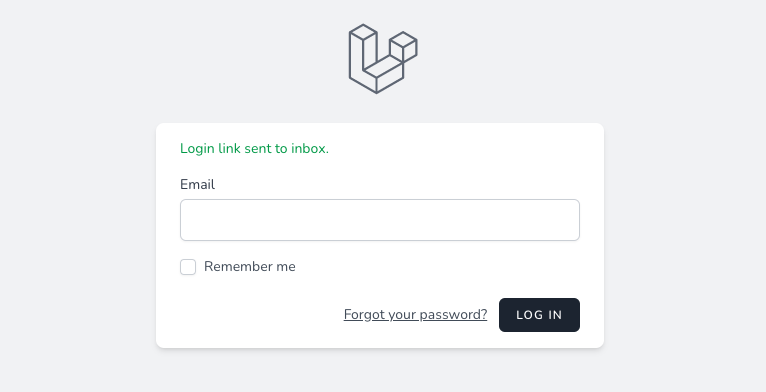

[](https://github.com/norbybaru/laravel-passwordless-authentication/actions/workflows/run-tests.yml) [](https://github.com/norbybaru/laravel-passwordless-authentication/actions/workflows/phpstan.yml) [](https://github.com/norbybaru/laravel-passwordless-authentication/actions/workflows/pint.yml)


# LARAVEL PASSWORDLESS AUTHENTICATION
Laravel Passwordless Authentication with Magic Link.

This package allows authentication via email link. 
It removes the need for users to provide password to authenticate but rely on user email address to send
them a login link to their inbox to follow to authenticate user securely.

**PS. Email provider must be setup correctly and working to email magic link to authenticate user**

## Installation

```sh
composer require norbybaru/passwordless-auth
```

## Publishing the config file
```sh
php artisan vendor:publish --provider="NorbyBaru\Passwordless\PasswordlessServiceProvider" --tag="passwordless-config"
```

## Preparing the database
You need to publish the migration to create table:
```sh
php artisan vendor:publish --provider="NorbyBaru\Passwordless\PasswordlessServiceProvider" --tag="passwordless-migrations"
```
After that, you need to run migrations.
```sh
php artisan migrate
```

# Basic Usage
## Preparing Model
Open the `User::class` Model and make sure to implements `NorbyBaru\Passwordless\CanUsePasswordlessAuthenticatable::class` and add trait `NorbyBaru\Passwordless\Traits\PasswordlessAuthenticatable::class` to the class

```php
<?php

namespace App\Models;

...
use Illuminate\Foundation\Auth\User as Authenticatable;
use Illuminate\Notifications\Notifiable;
use NorbyBaru\Passwordless\CanUsePasswordlessAuthenticatable;
use NorbyBaru\Passwordless\Traits\PasswordlessAuthenticatable;

class User extends Authenticatable implements CanUsePasswordlessAuthenticatable
{
    ...
    use Notifiable;
    use PasswordlessAuthenticatable;
    ...
}
```

## Preparing `config/passwordless.php`
Open config file `config/passwordless.php`
- Update `default_redirect_route` to the correct route name the user should land by default once authenticated in case you have different route name than `home`.
eg.
```
'default_redirect_route' => 'dashboard',
```

- Update `login_route` to the correct route name of your login page to allow redirecting user
back to that page on invalid magic link.
eg.
```
'login_route' => 'auth.login',
```

## Setup Login Routes
Make sure to setup new login routes and update your application to use the new login route

```php
<?php

use Illuminate\Support\Facades\Route;

Route::post('login', function (Request $request) {
    $validated = $request->validate([
        'email' => 'required|email|exists:users',
    ]);

    $status = Passwordless::magicLink()->sendLink($validated);

    return redirect()->back()->with([
        'status' => trans($message)
    ]);
});

```

## Setup Mail Provider
Make sure to have your application mail provider setup and working 100% for your Laravel application
```
MAIL_MAILER=
MAIL_HOST=
MAIL_PORT=
MAIL_USERNAME=
MAIL_PASSWORD=
MAIL_ENCRYPTION=tls
MAIL_FROM_ADDRESS=
MAIL_FROM_NAME="${APP_NAME}"
```

## Setup Translations
Add file `passwordless.php` in your translations directory and copy the entry below.
Feel free to update text to suit your application needs.

```php
return [
    'sent' => 'Login link sent to inbox.',
    'throttled' => 'Login link was already sent. Please check your inbox or try again later.',
    'invalid_token' => 'Invalid link supplied. Please request new one.',
    'invalid_user' => 'Invalid user info supplied.',
    'verified' => 'Login successful.',
];
```

## Setup Auth Provider

# Advance Usage
## Override MagicLinkNotification

## Run Unit Test
```sh
composer test
```

## Run Code Formatter
```sh
composer fmt
```